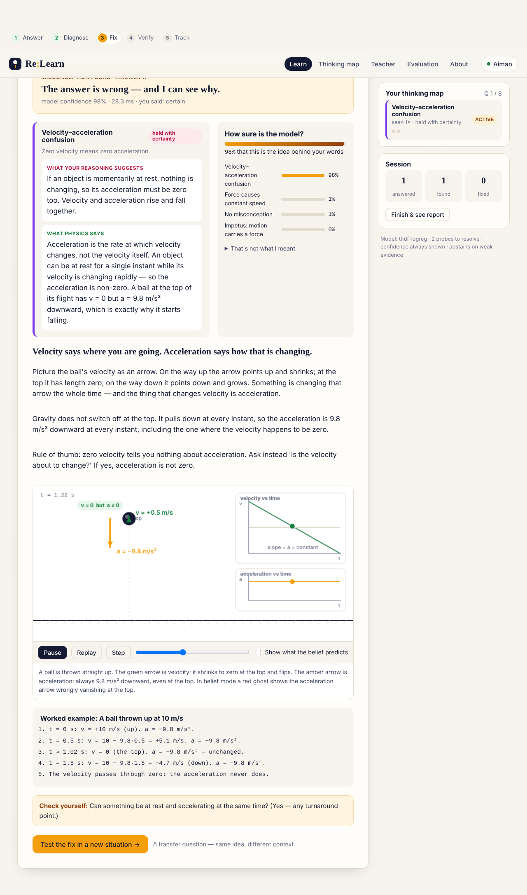
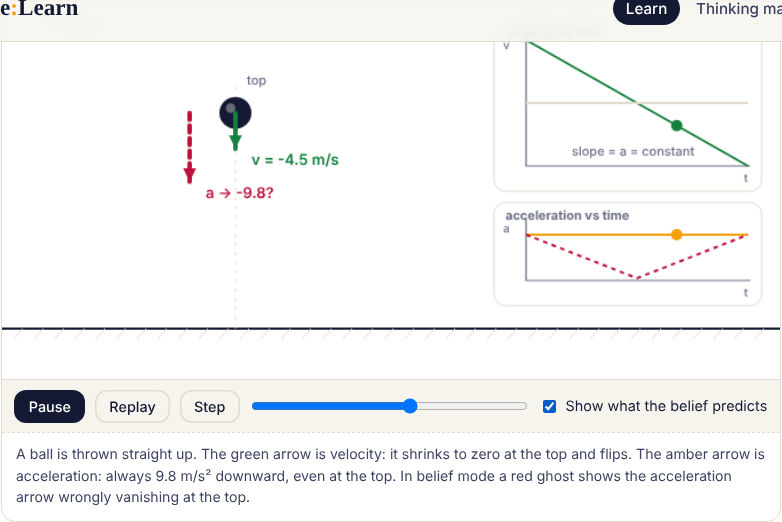
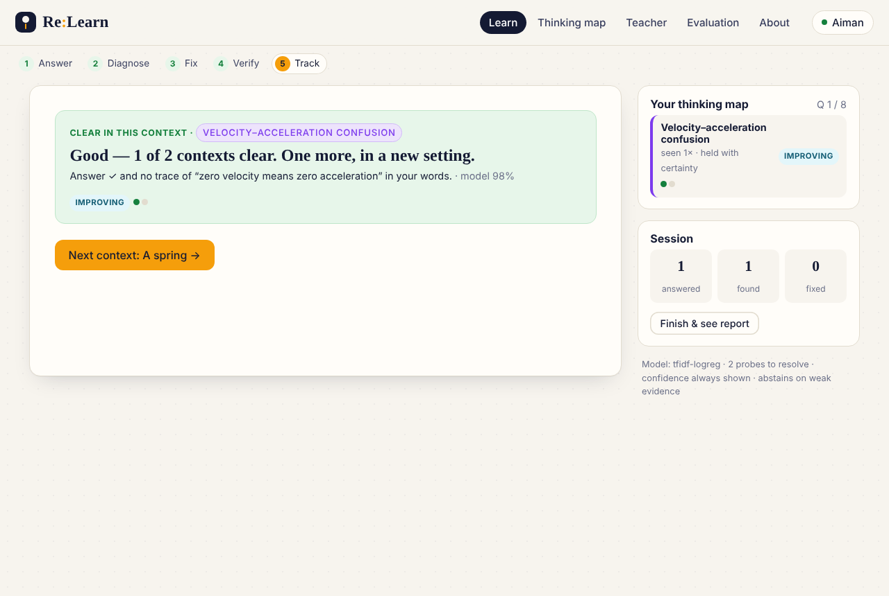

# Re:Learn — Adaptive Multimodal Learning Environment

> **Re:Learn doesn't tell you that you're wrong. It tells you *why*, fixes that, and checks that the fix stuck.**

An AI tutor for introductory mechanics that reads a learner's *answer and explanation together*, names the misconception behind the response, delivers a targeted intervention (explanation + worked example + physics animation), and verifies the fix with transfer questions in new contexts — resolved only when the answer is right **and** the reasoning is clean, twice, plus a delayed recheck.

Built for hackathon problem statement #3 from the Re:Learn PRD v1.0.



<p align="center"> </p>

---

## 60-second start (VS Code)

```bash
# 1. open the folder in VS Code, then in the terminal:
python -m venv .venv
.venv\Scripts\activate          # Windows      (macOS/Linux: source .venv/bin/activate)
pip install -r requirements.txt

# 2. one command does everything: dataset → train → evaluate → serve → open browser
python run.py
```

Or just double-click **`start.bat`** (Windows) / run **`./start.sh`** (macOS/Linux).
Or press **F5** in VS Code — the launch configuration *"Re:Learn — run everything"* is preselected.

The app opens at <http://127.0.0.1:8000>. First run trains the model (≈3 seconds, CPU only).

Requires Python 3.10+. No GPU, no API keys, no internet needed after `pip install`.

---

## What's in the box

| Piece | Where | Status vs PRD |
|---|---|---|
| Misconception taxonomy (5 FCI-derived ideas) | `backend/data.py` | §7 ✅ |
| 30-question bank, every wrong option mapped to the misconceptions that produce it | `backend/data.py` | FR-3 ✅ |
| Interventions: explanation + worked example + simulation per misconception | `backend/data.py`, `frontend/simulations.js` | FR-5 ✅ |
| 15 transfer probes (3 contexts per misconception) | `backend/data.py` | FR-6, FR-7 ✅ |
| Labelled dataset: 1,831 rows, 85 hand-written, split **by question** | `ml/generate_dataset.py` → `ml/data/` | FR-1, M2 ✅ |
| Trained classifier (TF-IDF + logistic regression; DeBERTa optional) | `ml/train.py`, `ml/model.py` | FR-2, M3 ✅ |
| Answer prior + abstain threshold + unseen-misconception embedding fallback | `ml/decision.py` | FR-9, FR-10, M5 ✅ |
| Evaluation suite: macro-F1, confusion matrix, confusable pairs, flawed-reasoning recall, held-out misconceptions, ECE | `ml/evaluate.py` → `ml/reports/` | FR-11, M4 ✅ |
| Flawed-reasoning detection (right answer, wrong idea) | `ml/decision.py` | FR-4 ✅ |
| Learner model: active / improving / resolved / recurring, SQLite | `backend/learner_model.py` | FR-8 ✅ |
| Multi-probe resolution + delayed recheck + recurring logic | `backend/learner_model.py`, `backend/app.py` | FR-7, M6 ✅ |
| Confidence capture → "held with certainty" flag | UI + learner model | FR-12 ✅ |
| Session report + progress rail + thinking map | `frontend/app.js` | FR-13 ✅ |
| Teacher class view | `/api/class`, Teacher tab | FR-14 ✅ |
| "That's not what I meant" feedback → exported as training rows | `/api/feedback`, `/api/feedback/export` | §15 open question ✅ |
| Scripted demo covering all 4 statuses + resolved / not-resolved | `demo/DEMO_SCRIPT.md`, `tests/test_api.py` | M7 ✅ |

### Evaluation results (from `python ml/evaluate.py`, shown live on the **Evaluation** tab)

| Metric | Value | PRD target |
|---|---|---|
| Diagnosis macro-F1, held-out questions | **0.99** | ≥ 0.80 |
| Confusable-pair accuracy (same option, 2+ possible misconceptions) | **0.97** | ≥ 0.75 |
| Flawed-reasoning recall | **0.98** | ≥ 0.70 |
| Unseen-misconception top-1 (leave-one-misconception-out, description embedding) | **0.85** | ≥ 0.60 |
| Calibration ECE | **0.05** | ≤ 0.10 |
| Latency per diagnosis (laptop CPU) | **~3 ms** | < 1 s |
| Template-only model on hand-written rows | 0.93 acc | — |
| Vague explanations sent to *unknown* | 94% | — |

**Honesty note.** The numbers above are high partly because the dataset is synthetic (hand-written seeds + templated student-style paraphrases, as the PRD's dataset plan prescribes). The most informative row is *template-only model on hand-written rows* (0.93), which measures transfer to writing the templates never saw. Real classroom data will be harder; the pipeline (feedback export → retrain) is built for that.

---

## The loop, as the learner sees it

1. **Answer** — choose an option, rate confidence (guessing / fairly sure / certain), explain in a sentence. Sentence starters reduce vague input.
2. **Diagnose** — one of four statuses, confidence always shown:
   - `correct` — right answer, sound reasoning
   - `flawed_reasoning` — right answer, but a misconception is hiding in the words
   - `misconception` — wrong answer, and the model can name why
   - `unknown` — too little evidence; the system asks for more instead of guessing
3. **Fix** — misconception name, *what your reasoning suggests* vs *what physics says*, headline explanation, canvas animation with a **"show what the belief predicts"** toggle (red ghost vs. reality), worked example, check-yourself.
4. **Verify** — a transfer question in a new context (thrown ball → pendulum, truck → mosquito). Resolved only if the answer is right **and** the targeted misconception is absent from the reasoning, in **2 different contexts**. A **delayed recheck** is injected a few questions later; failing it marks the idea **recurring**.
5. **Track** — the thinking map (sidebar + full tab) and the end-of-session report: right first time / found / fixed / improving / still open / recurring.

Try the PRD's own example on question 1 (ball at the top of its flight):

| Student | Pick | Explanation | Re:Learn says |
|---|---|---|---|
| A | A (zero) | "It stops at the top, so velocity is zero." | Velocity–acceleration confusion |
| R | A (zero) | "The force of the throw has run out." | Impetus |
| S | B (correct) | "It is still slowing down because of the throw force." | **Right answer, wrong idea** → Impetus |

---

## How diagnosis works (`ml/decision.py`)

```
classifier P(label | explanation, option text)
  → answer prior    labels the chosen option can produce are up-weighted ×2.5 (NONE ×2 if correct)
  → unseen fallback a misconception with a description but no training data is picked when the
                    explanation's similarity to that description leads the known ones by a margin
  → abstain         < 3 words or confidence < 0.45 → unknown, ask the learner to elaborate
  → status          correct | flawed_reasoning | misconception | unknown
```

The classifier deliberately does **not** see the question text, so it cannot learn question-specific shortcuts — and the evaluation split is by item, so every test question is unseen.

**Adding a misconception** = one entry in each of `MISCONCEPTIONS`, `INTERVENTIONS`, `PROBES`, plus mapping it on relevant options. Thanks to the embedding fallback it starts working from its description alone; retrain later for full accuracy.

---

## Project layout

```
relearn/
├── run.py                  one-command launcher
├── start.bat / start.sh    venv + install + run
├── requirements.txt
├── .vscode/                launch configs (F5), tasks, settings
├── backend/
│   ├── app.py              FastAPI routes
│   ├── data.py             taxonomy, 30 questions, interventions, 15 probes
│   ├── diagnosis.py        model wrapper
│   └── learner_model.py    SQLite learner model, resolution & recheck logic
├── ml/
│   ├── generate_dataset.py hand-written seeds + templated paraphrases + hard cases
│   ├── model.py            TF-IDF/LogReg classifier, optional DeBERTa, description embedder
│   ├── decision.py         answer prior → unseen fallback → abstain → status
│   ├── train.py            item-level split; trains served + held-out + template-only models
│   ├── evaluate.py         full metrics suite → ml/reports/{metrics.json, report.md, confusion_matrix.png}
│   ├── train_deberta.py    optional transformer backend
│   ├── data/               responses.csv, vague.csv, split.json
│   └── reports/            evaluation outputs (served at /api/metrics)
├── frontend/
│   ├── index.html, styles.css, app.js
│   └── simulations.js      5 canvas simulations with belief/physics modes
├── tests/test_api.py       13 end-to-end tests (all four statuses, resolve, recur, privacy)
└── demo/DEMO_SCRIPT.md     3-minute judge demo with exact inputs
```

## API

| Endpoint | Purpose |
|---|---|
| `GET /api/questions` | question list without answer keys |
| `POST /api/session/start` | `{learner, mode: quick|topic|full}` |
| `POST /api/diagnose` | `{learner, question_id, choice, explanation, confidence}` → status, misconception, intervention, transfer probe |
| `POST /api/reassess` | `{learner, misconception, probe_id, choice, explanation, phase}` → `resolved` true / false / null (inconclusive) |
| `GET /api/recheck/{learner}` | delayed-recheck probe if one is due |
| `GET /api/profile/{learner}` · `GET /api/report/{learner}` | learner model, session report |
| `POST /api/feedback` · `GET /api/feedback/export` | "that's not what I meant" → candidate training rows |
| `GET /api/class` | teacher view |
| `GET /api/metrics` | evaluation results |

Interactive docs at <http://127.0.0.1:8000/docs>.

## Useful commands

```bash
python ml/generate_dataset.py   # regenerate ml/data/responses.csv (1,831 rows) and vague.csv
python ml/train.py              # retrain all three models + embedder (~3 s)
python ml/evaluate.py           # full evaluation → ml/reports/
python -m pytest -q tests       # 13 tests
python run.py --retrain         # everything from scratch
python ml/train_deberta.py      # optional: pip install torch transformers datasets accelerate sentencepiece
```

Environment knobs: `RELEARN_PROBES_REQUIRED` (default 2), `RELEARN_RECHECK_GAP` (default 2 attempts), `RELEARN_DB` (SQLite path), `RELEARN_BACKEND=sklearn|auto`, `RELEARN_EMBEDDER=tfidf|st`.

## Non-functional requirements

- **Latency** ~3 ms per diagnosis on CPU.
- **Privacy** answer keys and option→misconception maps never leave the server (tested); learner data stays in a local SQLite file.
- **Accessibility** full keyboard flow (Ctrl+Enter submits), visible focus rings, `prefers-reduced-motion` disables autoplay (Step + scrubber instead), works at phone width.
- **Transparency** model confidence and top candidates always shown; abstains on weak evidence; learner can dispute a diagnosis.
- **Extensibility** a new misconception needs a description, an intervention and a probe.

## Non-goals (v1, per PRD)

Other domains, full course content, accounts/payments, handwriting input.
