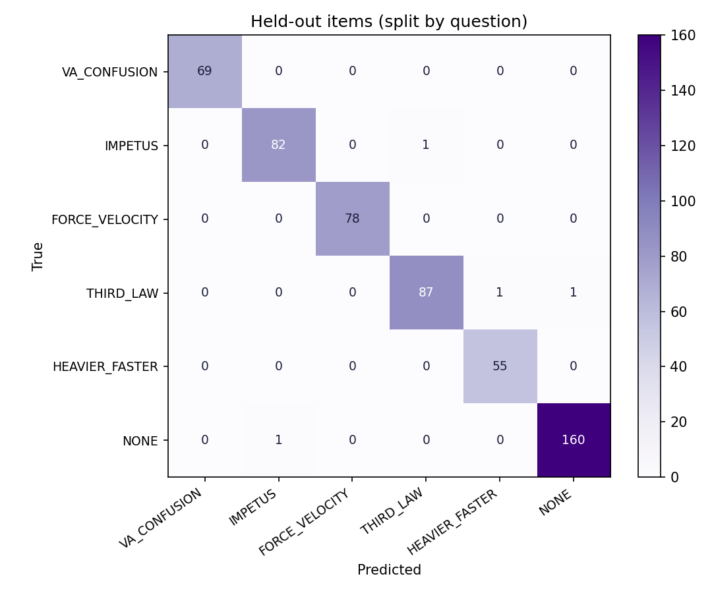

# Re:Learn evaluation report

Dataset: 1831 rows, 45 items, 85 hand-written. Split by item: 31 train / 14 test items.

| Metric | Value | Target | |
|---|---|---|---|
| Diagnosis macro-F1 (held-out questions) | 0.989 | ≥ 0.80 | ✅ |
| Confusable-pair accuracy (n=58) | 0.966 | ≥ 0.75 | ✅ |
| Flawed-reasoning recall (n=62) | 0.984 | ≥ 0.70 | ✅ |
| Unseen-misconception top-1 (leave-one-out) | 0.854 | ≥ 0.60 | ✅ |
| Calibration ECE | 0.060 | ≤ 0.10 | ✅ |
| Latency per diagnosis | 2.9 ms | < 1000 ms | ✅ |

## Secondary
- Held-out accuracy, all items: 0.993 (n=535)
- Held-out hand-written rows: acc 0.875 (n=24)
- Template-only model on ALL hand-written rows: acc 0.933, macro-F1 0.932, abstained 12%
- Flawed-reasoning false-alarm rate: 0.006
- Vague explanations sent to *unknown*: 94% (n=135); abstain rate on valid rows: 0%

## Unseen misconception (leave-one-misconception-out, embedding fallback)
| Held out | n | top-1 | top-1 when answered | abstained | false-positive rate |
|---|---|---|---|---|---|
| VA_CONFUSION | 69 | 0.72 | 0.88 | 17% | 1.5% |
| IMPETUS | 83 | 0.95 | 0.96 | 1% | 0.9% |
| FORCE_VELOCITY | 78 | 0.81 | 0.94 | 14% | 1.1% |
| THIRD_LAW | 90 | 0.91 | 0.98 | 7% | 1.3% |
| HEAVIER_FASTER | 56 | 0.88 | 0.89 | 2% | 1.7% |

## Per-label (held-out)
| Label | P | R | F1 | n |
|---|---|---|---|---|
| VA_CONFUSION | 1.00 | 1.00 | 1.00 | 69 |
| IMPETUS | 0.99 | 0.99 | 0.99 | 83 |
| FORCE_VELOCITY | 1.00 | 1.00 | 1.00 | 78 |
| THIRD_LAW | 0.99 | 0.98 | 0.98 | 89 |
| HEAVIER_FASTER | 0.98 | 1.00 | 0.99 | 55 |
| NONE | 0.99 | 0.99 | 0.99 | 161 |

